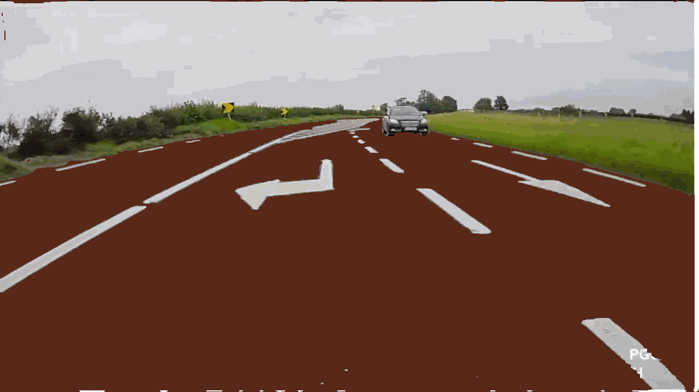
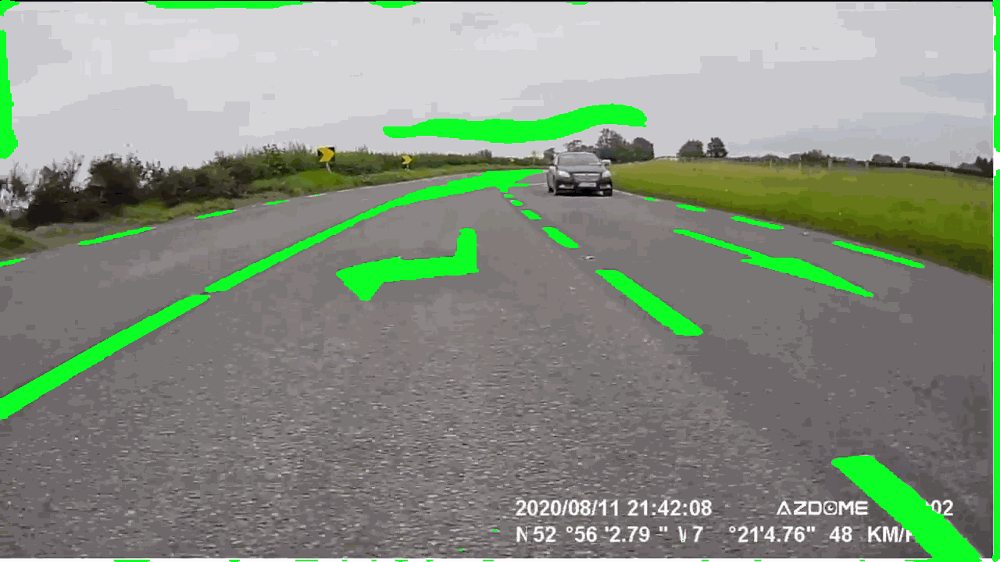

# Road segmentation

Generación de máscaras mediante entrenamiento usando Pytorch. Se overlapean entre sí para generar visualización con GIF.

**Surface road segmentation**


**Marking road segmentation**


## Uso

Generación de carpeta con imagenes segmentadas y overlapeadas entre sí para generar visualización
```
python segment.py
```